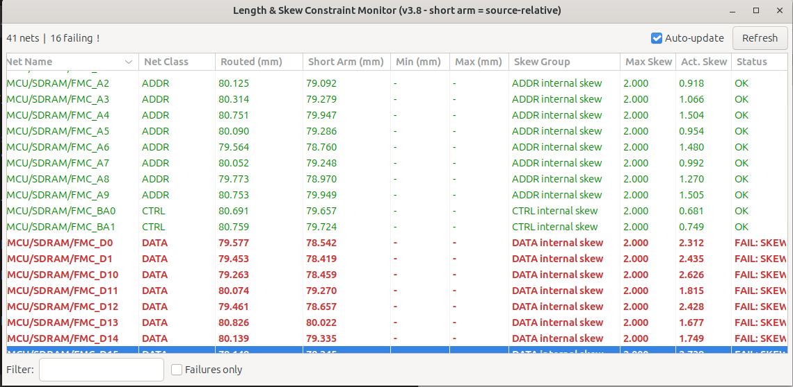

# Length Constraint Monitor — KiCad Plugin

A KiCad PCB Editor plugin that lists all nets with length constraints,
shows routed lengths, and highlights pass/fail status in a live table.



---

## Features

| Feature | Detail |
|---|---|
| Constraint discovery | Reads `.kicad_dru` rules **and** built-in NetClass constraints |
| Sortable columns | Click any column header to sort ascending/descending |
| Click net name | Selects all tracks on that net in the PCB editor |
| Click class name | Selects all tracks in that net class |
| Auto-update | Polls every 2 s; refreshes only when tracks change |
| Filter bar | Filter by net name or class name (text), or show failures only |
| Pass/Fail colour | Failing rows shown in red/bold |

---

## Installation

### Method A — Copy to KiCad scripting directory

Copy the **`length_monitor`** folder to your KiCad scripting plugins directory:

| OS | Path |
|---|---|
| Windows | `%APPDATA%\kicad\9.0\scripting\plugins\` |
| Linux | `~/.local/share/kicad/9.0/scripting/plugins/` |
| macOS | `~/Library/Preferences/kicad/9.0/scripting/plugins/` |

### Method B — Symlink (developer mode)

```bash
ln -s /path/to/length_monitor \
  ~/.local/share/kicad/9.0/scripting/plugins/length_monitor
```

### Activate the plugin

1. Open KiCad PCB Editor
2. **Tools** → **External Plugins** → **Refresh Plugins**
3. **Tools** → **External Plugins** → **Length Constraint Monitor**
   (or find the toolbar button if `show_toolbar_button = True`)

---

## Usage

### Length constraints in `.kicad_dru`

The plugin reads any rule that contains a `length` constraint:

```
(rule "SDRAM length"
    (condition "(A.NetClass == 'SDRAM')")
    (constraint length (min 50mm) (max 55mm))
)

(rule "DDR4 address strict"
    (condition "(A.NetClass == 'DDR4_ADDR')")
    (constraint length (opt 48.5mm))
)
```

- `(min …)` sets the minimum length
- `(max …)` sets the maximum length  
- `(opt …)` with no min/max is treated as both min **and** max (exact match)
- Units supported: `mm`, `um`, `mil`, `in`

### Columns

| Column | Description |
|---|---|
| Net Name | Full KiCad net name |
| Net Class | Assigned net class |
| Routed (mm) | Sum of all track segments on that net |
| Min (mm) | Minimum length constraint (`—` if none) |
| Max (mm) | Maximum length constraint (`—` if none) |
| Status | ✓ OK / ✗ FAIL |

### Selection

- **Click a row (Net Name column)** → selects all tracks on that net
- **Click the Net Class column cell** → selects all tracks in that class
- Selected items are highlighted in the PCB editor immediately

### Auto-update

- Enabled by default; polls every 2 seconds
- Only re-reads the board when track data has changed (zero cost otherwise)
- Uncheck "Auto-update" to pause polling (useful on very large boards)

---

## Troubleshooting

**No nets appear in the table**
- Ensure your `.kicad_dru` file contains `length` constraints (not just `clearance`)
- The plugin only shows nets that have at least one length constraint

**Constraints show as `—`**
- Check that your rule condition correctly references `A.NetClass == 'YourClass'`
- Verify the `.kicad_dru` file is saved next to the `.kicad_pcb` file

**Selection doesn't work**
- Run **Tools** → **Update PCB from Schematic** first to ensure net assignments are current
- Call `pcbnew.Refresh()` manually via the scripting console if the view doesn't update

---

## Compatibility

Developed and tested on KiCad 9. The `pcbnew` Python API is used directly;
no third-party packages required. The plugin relies on KiCad 9's
net-settings and connectivity APIs.
